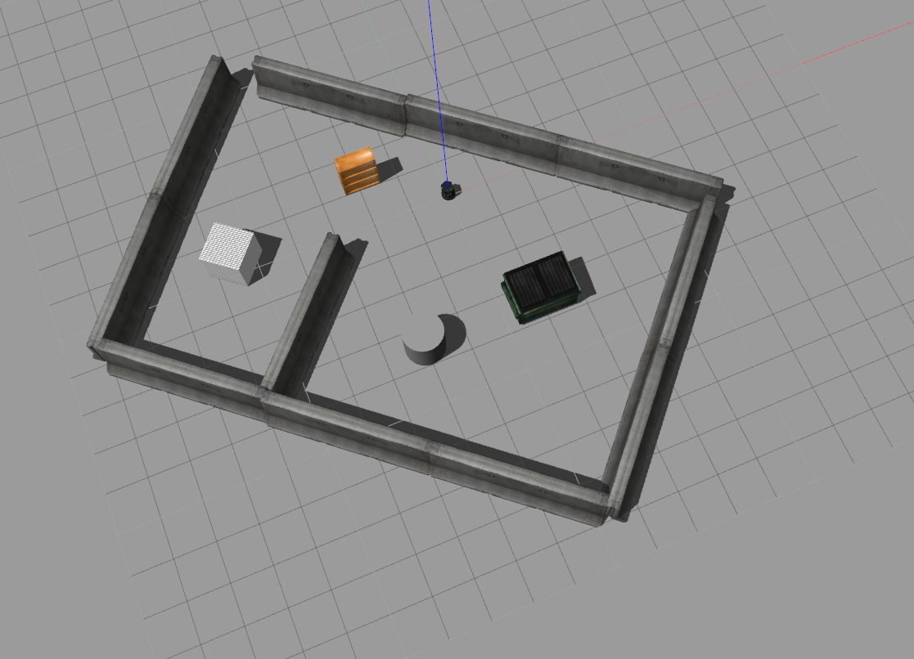
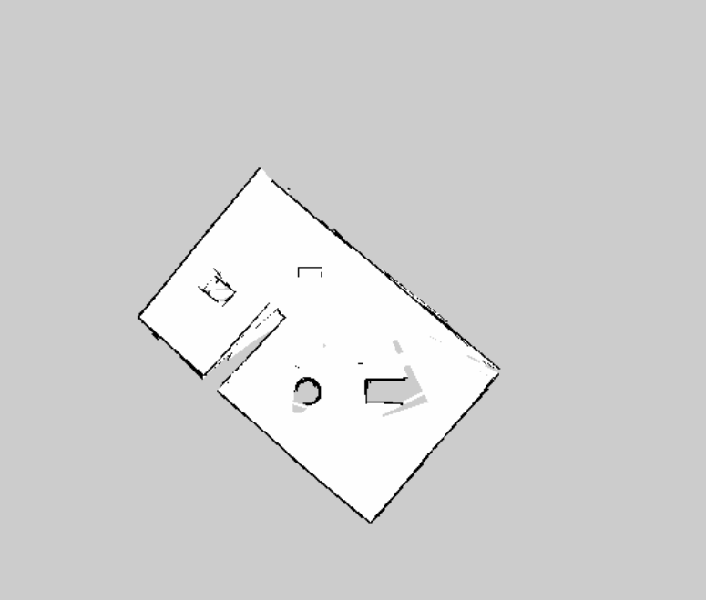

# *Naivik: An Autonomous Mobile Robot v0.2*

*This repository is the part of ENPM808X: Software Development of Robotics ME Coursework.* 

---

## Table of Contents
- [v0.2 Overview](#overview)
- [Author](#author)
- [SIP Process with Sprint Planning](#sip_process)
- [Video Presentation & Demo](#present)
- [Implementation](#implementation)
- [TODO](#futurework)
- [References](#refer)

##  v0.2 Overview

For any autonomous mobile robot, to be able to navigate autonomously in indoor environment, it needs to know the map of it. Now, map can be generated using SLAM. SLAM (simultaneous localization and mapping) is a technique for creating a map of environment and determining robot position at the same time. It is widely used in robotics. While moving, current measurements and localization are changing, in order to create map it is necessary to merge measurements from previous positions.

##  Author

My name is *Ashish Patel*, a developer and maintainer of this repository. I am a master student majoring in *Robotics at University of Maryland - College Park*. This repository is a part of the course ENPM808X - Software Development in Robotics. I hold a bachelors degree in Electronics & Communication from G H Patel College of Engineering located at Vallabh Vidyanagar, Gujarat, India.

##  SIP Process with Sprint Planning
Sprint Planing is provided in the google doc file, click on the link to access it: [Sprint Planning](https://docs.google.com/document/d/1cnqYP7j8j8OXodav0haAKlPngPgLUw-r7h47pi6sqGg/edit?usp=sharing)

The SIP Process followed is detailed in a spreadsheet, click on the link to access it: [SIP](https://docs.google.com/spreadsheets/d/1nMbX9Id-yYUnSFjK3-XCJu1AtMnWx-2TkpUoiuIMqgM/edit?usp=sharing)

##  Video Presentation & Demo
The project presentation is made using google presentation slides, click on the link to access it: [Presentation](https://docs.google.com/presentation/d/1P-7ZiaSU_TAKtFjx63iGmTSdBFGq3v5k5EBiq1V8JrM/edit?usp=sharing) 

##  Implementation

### Creating a Map

The below steps shows how to build a map which lets the robot remembers the environment. Robot can autonomously navigate around using the map.  
**1.** Create a folder for maps from your catkin_ws directory. `$ mkdir ~/catkin_ws/src/naivik_robot/map`  
**2.** Launch Gazebo world. `$ roslaunch turtlebot_gazebo turtlebot_world.launch world_file:=<full path to the world file>`  
**3.** Start map building. `$ roslaunch turtlebot_gazebo gmapping_demo.launch`  
**4.** Use Rviz to visualize the map building process. `$ roslaunch turtlebot_rviz_launchers view_navigation.launch`  
**5.** Change the option in Rviz.  
`Local map->Costmap->Topic` (choose /map from drop-down list)  
`Global map->Costmap->Topic` (choose /map from drop-down list).  
**6.** Launch teleop. `$ roslaunch turtlebot_teleop keyboard_teleop.launch`  
**7.** Drive the TurtleBot around.
> **NOTE:** The terminal with teleop launching has to be active all the time otherwise you won’t be able to operate the TurtleBot.

**8.** Save a map when your picture is good enough using the below command.
`$ rosrun map_server map_saver -f /home/<user_name>/catkin_ws/src/naivik_robot/map/maps`  
> **Note**: Steps from 2 to 7 can be launched simultaneously using generate_map launch file you just need to modify world file location in it.

**9.** Interrupt processes and close the terminals.

### Testing the generated Map

We can test the result of generated map using the below command.  
**1.** Launch Gazebo. `$ roslaunch turtlebot_gazebo turtlebot_world.launch world_file:=<full path to the world file> `  
**2.** Launch navigation demo.`$ roslaunch turtlebot_gazebo amcl_demo.launch map_file:=/home/<user_name>/catkin_ws/src/naivik_robot/map/maps.yaml`  
**3.** Launch Rviz. `$ roslaunch turtlebot_rviz_launchers view_navigation.launch`  
**4.** If you see a picture like the one stored in results directory by the name *test_map* then creating the map has been realized successfully. Close all the terminals and start autonomous navigation steps below.  
> **Note:** The above commands can be run by a single launch named test_map, you just need to change your world and map file location.

### Autonomous Navigation

The below steps shows how to use the TurtleBot in a known map.  
**1.** Launch Gazebo. `$ roslaunch turtlebot_gazebo turtlebot_world.launch world_file:=<full path to the world file>`  
**2.** Run the navigation demo. `$ roslaunch turtlebot_gazebo amcl_demo.launch:=<full path to map yaml file>`  
**3.** Launch Rviz. `$ roslaunch turtlebot_rviz_launchers view_navigation.launch`  
**4.** Send a navigation goal. Click the 2D Nav Goal button.  
**5.** Click on the map where you want the TurtleBot to drive and drag in the direction the Turtlebot should be pointing at the end.  

### Output of the above implementation

##### Gazebo World

##### Generated Map

##  TODO
The above approaches that where used to generate map and navigate on it, can be developed through our own source code.
- Teleoperation i.e. mapping can be replaced with more advanced way of map exploration like using frontier exploration methods and many more.
- For autonomous navigation, instead of using RVIZ we have develop a source code through which user can give the location of the region where they want to visit. For example, consider a scenerio where there is an indoor environment like a house where there are let say five rooms, location of those places can be obtained from the map generated through exploration techniques. Those locations can be fed to the source code and based on what user chooses the Robot should move and navigate to that location.
- ROS has a navigation stack called move_base which can be used for path planning and autonomous navigation. For path planning it has two path planners local and global, those path planners can be replaced my our own path planning algorithm depending on the required scenerio through plugins. It also takes into account the costmaps which helps to know the obstacles in front of robot. Along with it, it also contains localization algorithms build in it, to know robot's position in a map.

##  References

Apart from ROS Wiki below are few useful references that I used to complete uptill this point:  
**1.** SLAM navigation [Link_1](https://husarion.com/tutorials/ros-tutorials/6-slam-navigation/), [Link_2](http://learn.turtlebot.com/2015/02/03/8/)  
**2.** Path Planning [Link_2](https://husarion.com/tutorials/ros-tutorials/7-path-planning/#7-path-planning-graph-methods)  
**3.** Autonomous Navigation [Link_1](http://learn.turtlebot.com/2015/02/03/9/)  
**4.** For travis-ci and coveralls setup. [Link_1](https://github.com/felixduvallet/ros-travis-integration)

